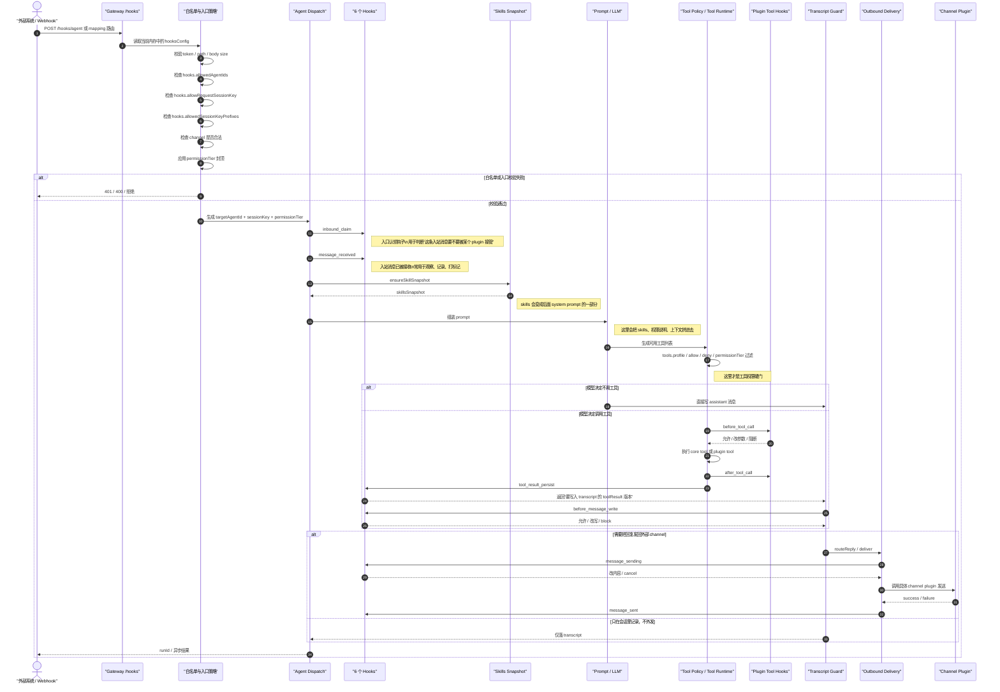
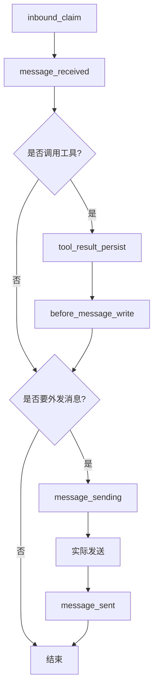

# Gateway 白名单、Hooks、Skills、Plugin 数据时序说明

这份文档说明一条典型外部请求是如何经过：

- gateway 白名单
- 6 个 hooks
- skills
- tools
- plugin

并最终进入会话、执行工具、写入 transcript、回发消息的。

## 范围

这里讨论的是一条典型 `/hooks` 请求进入系统后的主路径，尤其是：

- 外部 webhook 或其他系统调用 `gateway /hooks`
- gateway 如何做入口白名单过滤
- 数据如何进入 agent run
- 6 个 hooks 在流程中的位置
- skills 和 plugin 在链路中的角色

说明中的 6 个 hooks 指的是：

1. `inbound_claim`
2. `message_received`
3. `message_sending`
4. `message_sent`
5. `tool_result_persist`
6. `before_message_write`

注意：

- 不是每条请求都会经过这 6 个 hooks
- 是否命中某个 hook，取决于这次请求是否触发了对应阶段
- 例如没有调用工具，就不会经过 `tool_result_persist`
- 如果只是记到 transcript 而不外发，就不会经过 `message_sending` / `message_sent`

## 总体结论

可以把整条链理解成 5 层：

1. gateway 白名单层：决定请求能不能进入系统
2. 入站 hooks 层：决定入站消息是否被认领、是否要做附加处理
3. skills / prompt 层：决定模型本轮能看到哪些技能说明和上下文
4. tool / plugin 执行层：决定模型能调用什么工具、plugin 如何参与
5. transcript / outbound hooks 层：决定结果如何写入会话，以及如何发回外部 channel

一句话版：

`白名单决定能不能进，hooks决定中间怎么改，skills决定模型知道什么，plugin既能拦也能执行也能发送。`

## 参与者

- 外部系统：调用 `/hooks` 的 webhook、自动化服务、第三方系统
- Gateway：入口 HTTP 层
- 白名单策略：`hooks.allowedAgentIds`、`hooks.allowRequestSessionKey`、`hooks.allowedSessionKeyPrefixes`、`channel` 合法性、`permissionTier`
- Dispatch：把请求变成 agent run
- Hooks：6 个阶段性钩子
- Skills：本轮会话的技能快照与 prompt 注入
- Tools：core tools 或 plugin tools
- Plugin：既可能注册 hooks，也可能提供 tool/channel 能力
- Transcript Guard：控制写入 session transcript 的最终内容
- Outbound Delivery：把结果发回 Telegram / Discord / Slack / WhatsApp 等 channel

## 主时序图

## 6 个 Hooks 自己的顺序

如果只看这 6 个 hooks，自然顺序通常是下面这样：

更通俗一点：

- `inbound_claim`：先决定谁接这条入站消息
- `message_received`：消息进入系统后，做观察或打标记
- `tool_result_persist`：工具结果准备写入 transcript 前先处理一下
- `before_message_write`：任何消息真正写入 transcript 前最后再过一道
- `message_sending`：消息真正发出去前最后再改一次
- `message_sent`：消息发完后做结果通知

## Gateway 白名单在过滤什么

经过 gateway 的 `/hooks` 请求，最先经过的是入口白名单和策略层。

它主要过滤这些内容：

- `token` 是否正确
- `agentId` 是否在 `hooks.allowedAgentIds` 里
- 外部是否允许自己指定 `sessionKey`
- 如果允许，`sessionKey` 前缀是否在允许范围内
- `channel` 是否是合法 channel
- 本次请求的 `permissionTier` 上限是多少

这里要注意：

- 它主要过滤的是“目标 agent / session / channel / 权限等级”
- 不是在按消息正文内容做关键词白名单

## 每层都在干什么

### 1. Gateway 白名单层

这是最前面的“门卫”。

它的职责是：

- 不让未授权的请求进入系统
- 不让外部请求随便指定任意 agent
- 不让外部请求随便写进任意 session
- 给这次请求设置一个权限上限

通过以后，gateway 才会把这次请求转成内部 agent run。

### 2. 入站 Hooks 层

这里主要是两个 hook：

- `inbound_claim`
- `message_received`

含义分别是：

- `inbound_claim`：谁来认领这条消息
- `message_received`：消息已经进入系统，现在可以观察、记录、打标签、补元数据

这一层常见用途：

- 某个 plugin 想接管一类 webhook
- 做入站审计
- 记录来源、线程、会话信息

### 3. Skills 层

这层不是“拦截器”，更像“给模型补一段说明书”。

系统会先生成当前会话的 `skillsSnapshot`，然后把技能 prompt 拼进 system prompt。

所以 skills 的作用不是直接拦请求，而是影响模型这一轮：

- 知道哪些技能存在
- 知道技能的使用规则
- 知道技能给出的额外上下文

### 4. Tool / Plugin 执行层

这是“模型真正动手做事”的地方。

这里会先决定：

- 这一轮工具是否可用
- 哪些工具可用
- 当前权限下能不能调用某个工具

然后如果模型决定调用工具，会继续经过：

- `before_tool_call`
- 执行工具
- `after_tool_call`

这一层里，plugin 可能扮演三种角色：

- 提供 hook
- 提供 tool
- 提供 channel 能力

### 5. Transcript / Outbound Hooks 层

这层负责两个问题：

1. 写入 transcript 前怎么处理
2. 发回外部 channel 前怎么处理

先看 transcript：

- `tool_result_persist`：只针对 tool result，先决定“写入会话的版本长什么样”
- `before_message_write`：任何消息真正写入 transcript 前的最后一关，可以改写，也可以直接 block

再看 outbound：

- `message_sending`：发送前最后改一次内容，或者取消发送
- `message_sent`：发送完成后做结果通知，成功失败都会经过

## Skills、Plugin、Hooks 三者的关系

这三个东西很容易混。

最简单的区分方法是：

- hooks：流程中的“拦截点”
- skills：给模型的“额外说明/能力说明”
- plugin：提供 hooks、tools、channel、skills 的扩展容器

也就是说：

- hooks 是阶段
- skills 是内容
- plugin 是提供这些能力的载体

一个 plugin 可以：

- 注册 `inbound_claim`
- 注册 `message_sending`
- 提供一个 tool
- 提供一个 channel sender
- 自带一组 skills

## 你最该记住的 4 句话

1. gateway 白名单决定“这条请求能不能进系统”
2. hooks 决定“每一步能不能改、能不能拦”
3. skills 决定“模型这一轮知道什么”
4. plugin 可以同时参与 hook、tool、channel、skills 四种能力

## 简短总结

如果把整个流程拟人化：

- gateway 白名单像门卫
- hooks 像每个楼层的检查点
- skills 像给模型的工作手册
- plugin 像外包团队，可能负责检查、执行、发消息、补工具

所以一条外部请求不是“直接进模型”，而是：

`先过门卫，再过检查点，再带着技能手册去思考，需要时调用工具，最后再决定怎么写入和怎么发出。`
